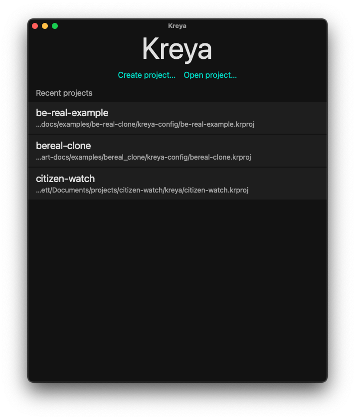
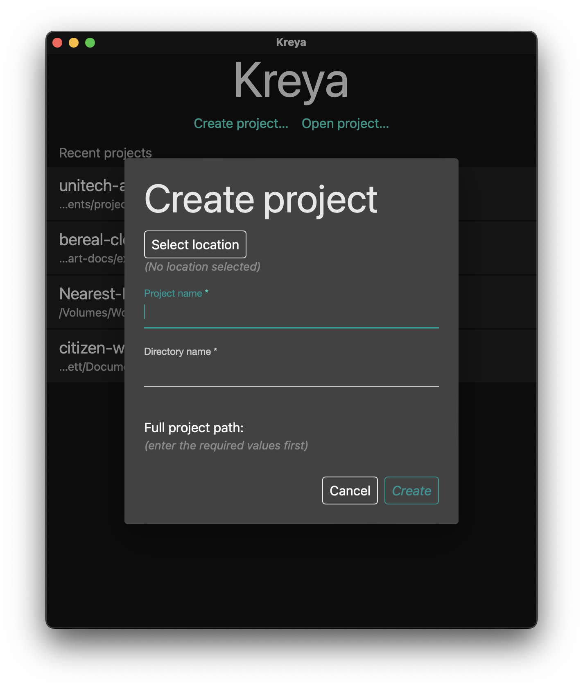
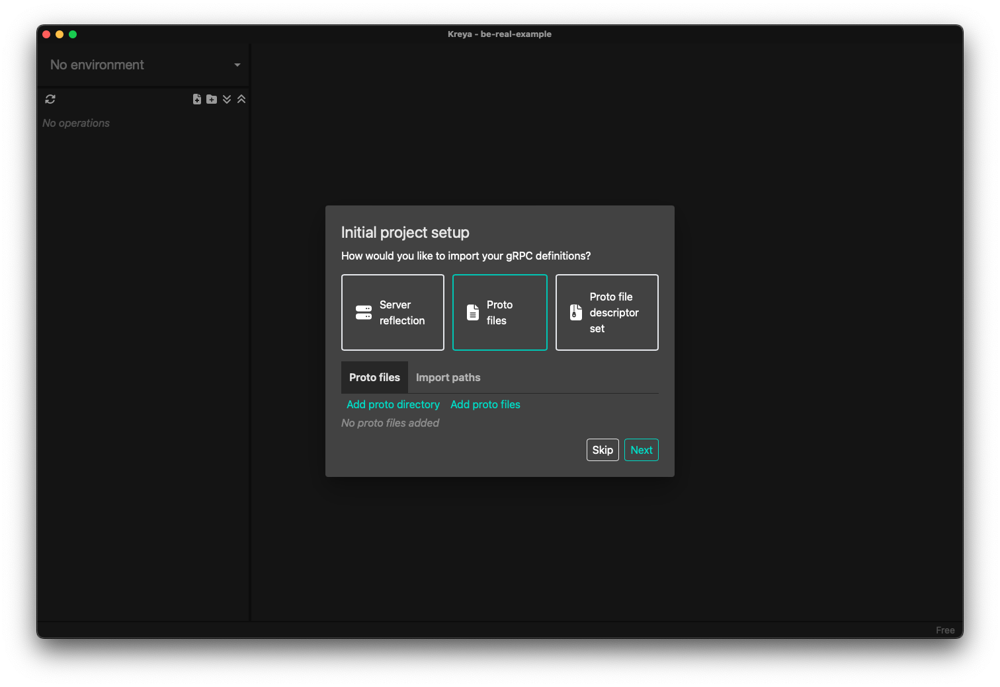
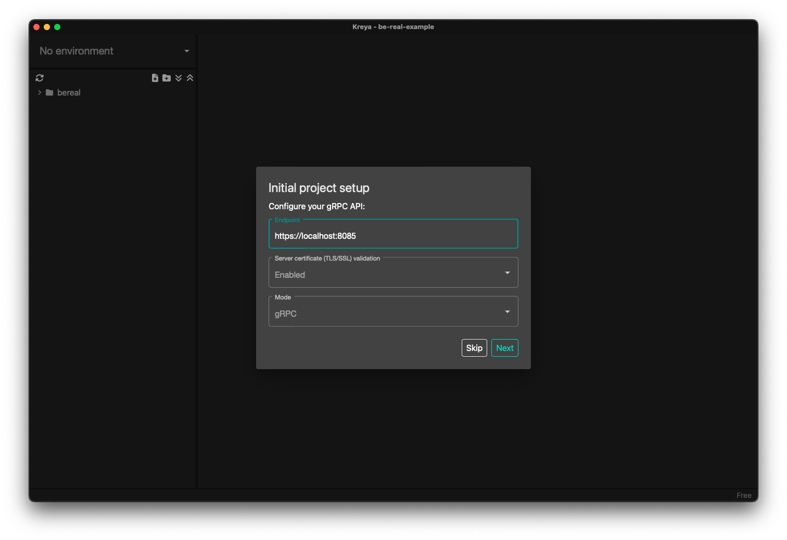
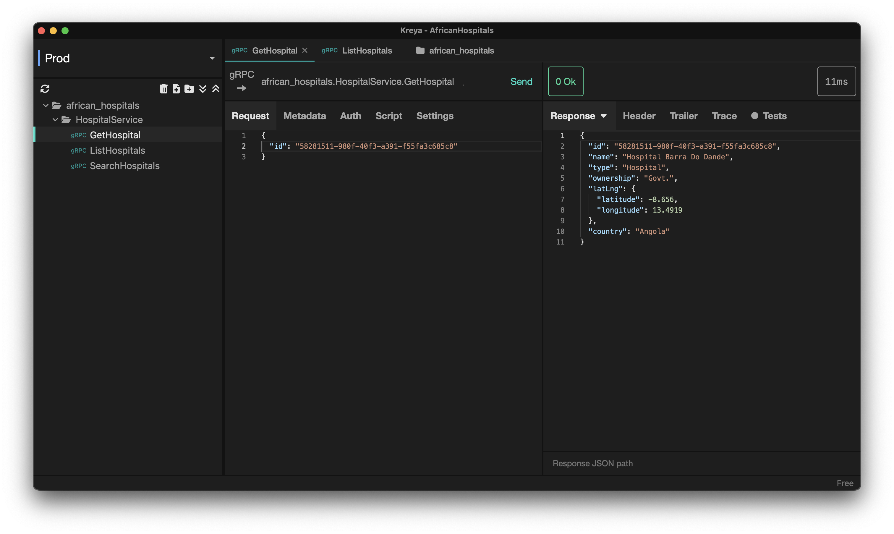

# Kreya Desktop Client

Kreya is a beautiful GUI client that can be used to quickly test your gRPC services.It makes calling your APIs a breeze. It's the replacement of the now archived project BloomRPC which was a desktop client that enabled easy calls to gRPC services.

You can download it at https://kreya.app/.

Once installed open it. You'll get a page that looks like the following

Click `Create Project`. 

Kreya stores your project configuration in a folder on your machine. Click on `Select Location` to specify this location. In the `Directory name` location, enter the name you'd want this directory to be called. 

Give it a project name and click `Create`. 

In the initial project setup popup, when asked what types of APIs, choose gRPC or REST if you plan to include REST apis here as well then click Next. 

Next, we'll need to tell Kreya where to find our gRPC services. 
It supports 
1. Server reflection
2. Choose your proto directory or proto definition file. 
3. Proto file descriptor set

Choose one option and click `Next`. 

# Server details
On the next page, choose where your server is running on, and whether it's using TLS/SSL. Here you'll also choose the mode under which you want the traffic transmitted as. You can use plain gRPC,gRPC web and gRPC Web(Text). 

Once completed, you'll see the list of services available in your available proto definitions. 
1. Choose one Service
2. Choose a method. 
3. Once you've selected a method, you can modify the request parameters and click on Send. 
4. You'll get either a response or an Error when you send the request. 

